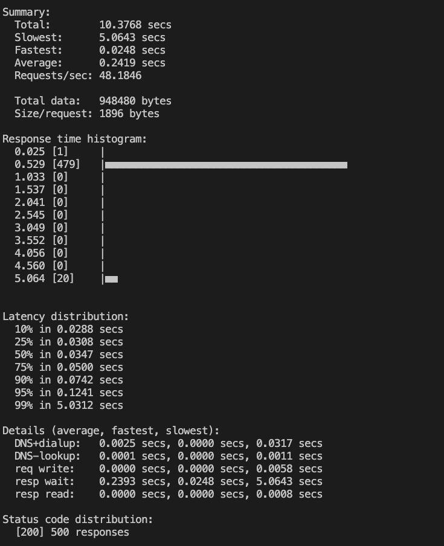
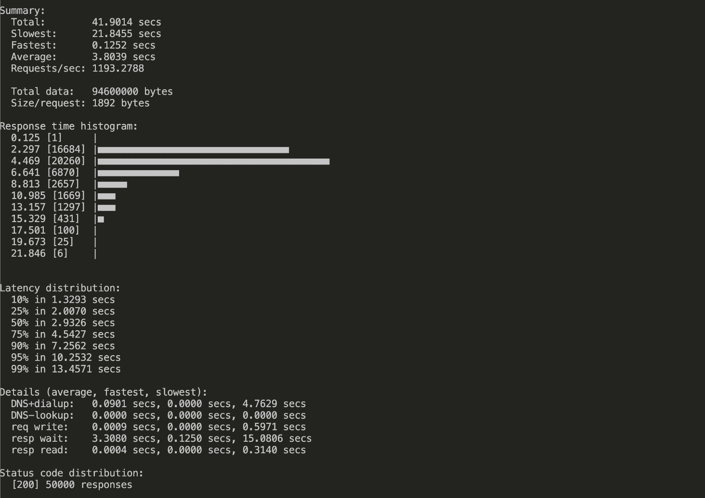

# Usage

hey runs provided number of requests in the provided concurrency level and prints stats.

It also supports HTTP2 endpoints.

```
Usage: hey [options...] <url>

Options:
  -n  Number of requests to run. Default is 200.
  -c  Number of workers to run concurrently. Total number of requests cannot
      be smaller than the concurrency level. Default is 50.
  -q  Rate limit, in queries per second (QPS) per worker. Default is no rate limit.
  -z  Duration of application to send requests. When duration is reached,
      application stops and exits. If duration is specified, n is ignored.
      Examples: -z 10s -z 3m.
  -o  Output type. If none provided, a summary is printed.
      "csv" is the only supported alternative. Dumps the response
      metrics in comma-separated values format.

  -m  HTTP method, one of GET, POST, PUT, DELETE, HEAD, OPTIONS.
  -H  Custom HTTP header. You can specify as many as needed by repeating the flag.
      For example, -H "Accept: text/html" -H "Content-Type: application/xml" .
  -t  Timeout for each request in seconds. Default is 20, use 0 for infinite.
  -A  HTTP Accept header.
  -d  HTTP request body, better with -randmark.
  -D  HTTP request body from file. better with -randmark.
  -T  Content-type, defaults to "text/html".
  -U  User-Agent, defaults to version "hey/0.0.1".
  -a  Basic authentication, username:password.
  -x  HTTP Proxy address as host:port.
  -h2 Enable HTTP/2.

  -host	HTTP Host header.

  -disable-compression  Disable compression.
  -disable-keepalive    Disable keep-alive, prevents re-use of TCP
                        connections between different HTTP requests.
  -disable-redirects    Disable following of HTTP redirects
  -cpus                 Number of used cpu cores.
                        (default for current machine is %d cores)

  -cert certfile location
  -key keyfile location
  -urlfile urlfile location
  -url url link
  -r rounds, should with method GET only
  -rs each round skip time, should with method GET only
  -randmark replace HEY mark from url, header, payload with goroutine number
  -respcheck check response body, like -respcheck "\"code\":201" -respcheck "\"msg\":\"good\""
```



